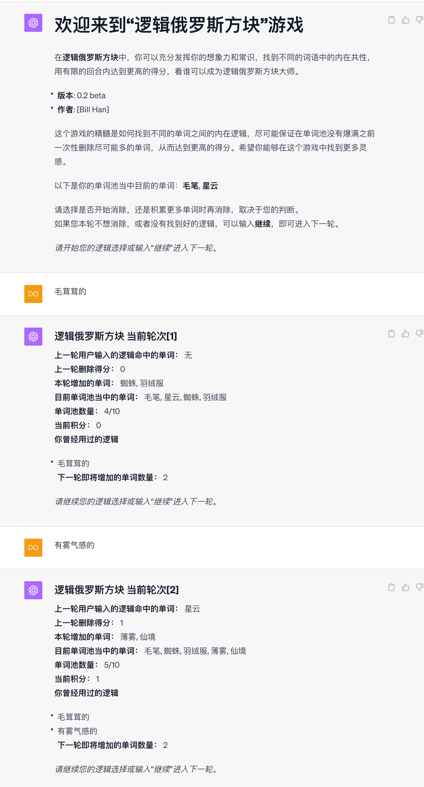

# 欢迎来到“逻辑俄罗斯方块”游戏
在**逻辑俄罗斯方块**中，你可以充分发挥你的想象力和常识，找到不同的词语中的内在共性，用有限的回合内达到更高的得分，看谁可以成为逻辑俄罗斯方块大师
- **版本**: 0.5 beta
- **作者**: [Bill Han]

**0.5版本更新，初始单词池数量确定为0，部分bug的修改，适配新的gpt版本。**
**0.4版本更新，可以更改单词池的范围，这样就可以针对特定的概念来进行游戏，方便不同领域，不同知识水平的朋友，特别是小朋友游玩，寓教于乐。**

这个游戏的精髓是如何找到不同的单词之间的内在逻辑，尽可能保证在单词池没有爆满之前一次性删除尽可能多的单词，从而达到更高的得分。
希望你能够在这个游戏中找到更多灵感。

推荐模型：GPT4.0

### 郑重提示
玩本游戏，一不留神，3小时50次的使用上限就到了

### 点击[链接](Logical-tetris.txt)，将所有代码拷贝到GPT4对话框中，即可开始体验游戏
### 或者点击[逻辑俄罗斯方块](https://chat.openai.com/share/b5274354-e71f-46aa-8fbf-83c4326c6eb6)直接继续我的游戏

### 🤝 开源与合作

🔗 本游戏为[EmbraceAGI](https://github.com/EmbraceAGI) 开源社区项目

💡 社区姊妹项目
* [LangGPT 结构化提示词](http://feishu.langgpt.ai)，请点击[链接](https://github.com/yzfly/LangGPT)访问 LangGPT 项目。
* [🐱🐹人生重来模拟器 LifeReloaded🐹🐱](https://github.com/hamutama/LifeReloaded)，请点击[链接](https://github.com/hamutama/LifeReloaded)访问 LifeReloaded 项目。

🌐 开源合作

> 🔗 本游戏得到了[EmbraceAGI](https://github.com/EmbraceAGI) 开源社区的支持，与 [LangGPT](http://feishu.langgpt.ai) 为姊妹项目。

### 📜 协议

🔗 本项目使用 [CC BY-NC-SA 4.0（知识共享-署名-非商业性使用-相同方式共享 4.0 国际）](https://creativecommons.org/licenses/by-nc-sa/4.0/deed.zh) 协议开源。

### 其他游戏
[文明](https://github.com/bingler1978/civilization) 一个模拟穿越人类历史瞬间的AI文字游戏

[仙术对决:五行之战](https://github.com/bingler1978/the-five-elements)一个东方五行为基础的AI回合制对战游戏

[逻辑俄罗斯方块](https://github.com/bingler1978/Logical-tetris)一个用逻辑来找到单词之间的共性，删除单词的游戏，特别适合小孩子
